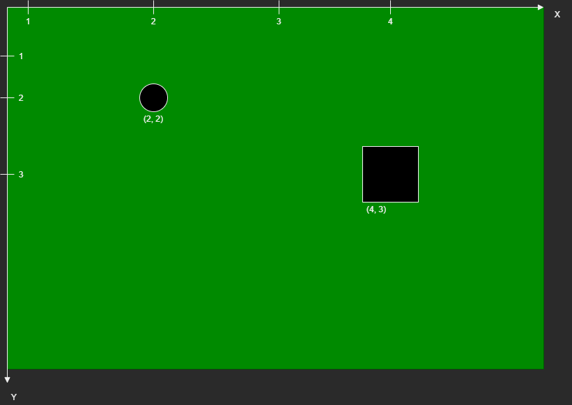

# 11. Übungsblatt Thema: Events 

**Einführung:**

Hier werden wir ein Level System implementieren. Ein Level wird durch eine 2d Array dargestellt für ein 2d Game.
Entities werden als Game Objekte in diesem Array platziert und auch dort hin und her bewegt.

In einigen Videospielen liegt der Ursprungspunkt des Koordinatensystems Links oben am Bildschirm

In unserem Beispiel heist das, dass es keine negativen Koordinaten gibt für eine Position,
da wir sonst nicht so einfach mit einen 2d Array arbeiten könnten.

Siehe folgendes Bild:



Wenn wir nach links gehen wird die x verringert \
Wenn wir nach rechts gehen wird die x erhöht. \
Wenn wir nach oben gehen wird die Y verringert. \
Wenn wir nach unten gehen wird die Y erhöht.

<div class="page-break"></div>

## 1. Anlegen von Klasse Entity


**Deklaration:**

```csharp
public virtual char Identifier { get; } = 'x';
public int X { get; private set; }
public int Y { get; private set; }

public Entity(int x, int y);

// Methods
public void MoveLeft();
public void MoveRight();
public void MoveUp();
public void MoveDown();
```

---

**Beschreibung:**

Constructor Entity soll die Property X und Y setzten mit Hilfe der gegebenen Parameter.

MoveLeft soll die Entität nach links bewegen und damit die X Koordinate dekrementieren um 1. \
MoveRight soll die Entität nach rechts bewegen und damit die X Koordinate inkrementieren um 1. \
MoveUp soll die Entität nach oben bewegen und damit die X Koordinate dekrementieren um 1. \
MoveDown soll die Entität nach unten bewegen und damit die X Koordinate inkrementieren um 1.

Die ToString soll so überschrieben werden das zum Beispiel mit den Property X = 2, Y = 4 und Identifier = x
folgender String zurückgegeben.
> x: (2, 4)

---

*Test Program:*

```csharp
var player = new Entity(0, 0);
Console.WriteLine(player.ToString());
player.MoveRight();
player.MoveDown();
Console.WriteLine(player.ToString());
player.MoveUp();
Console.WriteLine(player.ToString());
```

*Ausgabe sollte sein:*

x: (0, 0) \
x: (1, 1) \
x: (1, 0)

---

<div class="page-break"></div>


## 2. Anlegen von Klasse Level


**Deklaration:**

```C#
public char StandardTile {get; private set;} = '.';
public Level(int height,int width);
public void AddEntity(Entity newEntity);
```

**Beschreibung:**

Constructor Level soll ein inneres 2d Array initialisieren.
Parameter height ist dabei die Länge der 1 Demention und parameter width ist die Länge der 2 Demention des Arrays.
Die Elemente des Arrays ist vom Type Entity.

Diese innere Array stellt das Level dar in dem sich Game Objekte befinden !

AddEntity platziert den Parameter newEntity genau an die Stelle anhand seiner Property X und Y.
Beispiel: newEntity mit X = 8 und Y = 4 kommt in inneres array[4, 8] hinein

Die ToString soll so überschrieben werden, dass das array in einen bestimmten Format als string zurück gegeben wird.
Es soll ein Zeilenumbruch angeben kommen nach jeder Zeile im Array.
Wenn an einer Stelle des arrays noch keine Instanz hinterlegt ist, soll . eingesetzt werden ansonsten soll das Property Identifier von der
Instance eingesetzt werden.

Beispiel:

```C#
var level = new Level(5, 5);
level.AddEntity(new Entity(0, 0));
level.AddEntity(new Entity(2, 2));
level.AddEntity(new Entity(2, 3));
Console.WriteLine(level.ToString());
```
Ausgabe: \
x.... \
..... \
..x.. \
..x.. \
.....

---

<div class="page-break"></div>

*Test Program:*

```C#
var level = new Level(10, 10);
Console.WriteLine(level.ToString());
level.AddEntity(new Entity(0, 0));
level.AddEntity(new Entity(2, 2));
level.AddEntity(new Entity(2, 3));
level.AddEntity(new Entity(7, 7));
level.AddEntity(new Entity(9, 8));
Console.WriteLine(level.ToString());
```

*Ausgabe sollte sein:* \
.......... \
.......... \
.......... \
.......... \
.......... \
.......... \
.......... \
.......... \
.......... \
.......... \
\
x......... \
.......... \
..x....... \
..x....... \
.......... \
.......... \
.......... \
.......x.. \
.........x \
..........

---

<div class="page-break"></div>


## 3. Implementierung von Event Movement

**Beschreibung:**

Zuerst soll folgender enum und delegate aushalb der Klasse Entity
direkt darüber platziert werden

**Deklaration:**

```C#
  public enum MoveDirection
  {
    Left,
    Right,
    Up,
    Down
  }

  public delegate void Movement(Entity self, MoveDirection moveDirection);

  public Entity
  {
      ....
```

Die Klasse Entity soll nun ein öffentliches event Namens HasMoved haben.
Dieses Event soll vom Typ Movement sein.

Dieses Event soll immer dann ausgelöst werden falls eine Entität eine Bewegung durchgeführt hat.

Der 1. Parameter soll dabei die Entity selber sein.
Der 2. Parameter ist dabei die Richtung, in der sich eine Entity bewegt hat.

Lege ein Methode OnMove in der Klasse Level an.

Beim Aufruf von AddEntity soll die Methode OnMove an das Event HasMoved, der hinzugefügeten Entität, die
Methode OnMove registrieren.

Die Methode OnMove soll folgendes machen:
Die Entität als 1. Parameter soll an der alten Position im Level entfernt werden und wieder an der neuen Position im Level eingesetzt werden.

---

*Test Program:*

```C#
var level = new Level(5, 5);
var player = new Entity(2, 2);
level.AddEntity(player);
Console.WriteLine(level.ToString());
player.MoveLeft();
Console.WriteLine(level.ToString());
player.MoveUp();
Console.WriteLine(level.ToString());
player.MoveRight();
Console.WriteLine(level.ToString());
player.MoveDown();
Console.WriteLine(level.ToString());
```

<div class="page-break"></div>

*Ausgabe sollte sein:* \
..... \
..... \
..x.. \
..... \
..... \
\
..... \
..... \
.x... \
..... \
..... \
\
..... \
.x... \
..... \
..... \
..... \
\
..... \
..x.. \
..... \
..... \
..... \
\
..... \
..... \
..x.. \
..... \
.....

---

<div class="page-break"></div>


## 4. Implementierung von Movement außerhalb des Levels

**Beschreibung:**

Als nächstes soll sicher gestellt werden, dass sich eine Entität nicht außerhalb des Levels bewegen kann.

Lege einen neuen delegate an

Declaration von delegate Collision:
```C#
public delegate void Collision(Entity self,Entity other, MoveDirection moveDirection);

public class Level
{
  ...

```

Lege ein neues Event an namens LevelCollision vom Type Collision an, in der Klasse Level.

Innerhalb von der Methode OnMove soll das Event Collision gefeuert werden, falls eine Entität sich außerhalb des Levels bewegt. 
Hierbei soll der 1. Parameter die Entität sein, welche sich bewegt hat. Der 2. Parameter soll hier erstmal null sein. 
Dadurch das der 2. Parameter null ist, wird angezeigt eine Collision durch das Verlassen des Levels stattfand. 
Der 3. Parameter ist die Richtung der Bewegung.
Außerhalb bedeutet, dass die neue Position der Entität eine OutOfBoundException des inneren 2d Arrays in der Level erzeugen würde. 

Lege ein Methode namens OnCollision an in der Klasse Entity.
OnCollision soll auch virtuell sein.
Bei der Methode AddEntity soll sich eine Entity für das Event Collision regestieren mit der Methode OnCollision.
Diese Methode OnCollision soll die Entität wieder in die Position bringen welche vor Bewegung vorlag, falls der 1. Parameter die Entität selbst ist.
Das heißt, dass wenn sich mehre Entitäten für das Event Collision registriert haben, dann soll sich nur die eine Entitäten, welche die Bewegung ausführte, darauf reagieren.

---

*Test Program:*

```C#
var level = new Level(3, 3);
var player = new Entity(1, 1);
level.AddEntity(player);
Console.WriteLine(level.ToString());
player.MoveLeft();
Console.WriteLine(level.ToString());
player.MoveLeft();
Console.WriteLine(level.ToString());
```

*Ausgabe sollte sein:* \
... \
.x. \
... \
\
... \
x.. \
... \
\
... \
x.. \
...

---

<div class="page-break"></div>


## 5. Implementierung von Obstacle und Player

**Beschreibung:**

Als nächstes soll eine Kollision zwischen Game Objekten implementiert werden.
Das heist Objekt A kann nicht an der gleichen Stelle wie Objekte B stehen !
Wenn also Objekt A sich in Objekt B hineinbewegt, dann soll Objekt A sich wieder in seine vorige Position zurück bewegen.

2 Klassen Obstacle und Player werden angelegt. Diese beiden Klassen erben von Klasse Entity

Player Klasse soll das Property Identifier überschreiben ,so dass der Wert 'P' ist.
Obstacle Klasse soll das Property Identifier überschreiben ,so dass der Wert '#' ist

In der Methode OnMove in der Klasse Level soll geprüft werden ob die neue Position im Level schon bereits besetzt ist durch eine
andere Entität. In diesem Fall, soll das Event Collision unter der Klasse Level gefeuert werden. 
Der 1. Parameter des gefeuerten Events soll die Entität sein welche sich bewegt hat.
Der 2. Parameter ist die Entität, welche sich schon an der neuen Stelle befindet.
Der 3. Parameter ist die Richtung der Bewegung.

---

*Test Program:*

```C#
var level = new Level(4, 4);
level.Collision += (entity, direction) => { Console.WriteLine($"Collision at {entity.X}, {entity.Y}"); };
var player = new Player(1, 1);
level.AddEntity(player);
level.AddEntity(new Obstacle(1,2));
level.AddEntity(new Obstacle(2,2));
level.AddEntity(new Obstacle(0,3));
level.AddEntity(new Obstacle(1,3));
level.AddEntity(new Obstacle(2,3));
level.AddEntity(new Obstacle(3,3));
level.AddEntity(new Obstacle(0,0));
Console.WriteLine(level.ToString());
player.MoveRight();
Console.WriteLine(level.ToString());
player.MoveDown();
player.MoveRight();
player.MoveDown();
Console.WriteLine(level.ToString());
player.MoveDown();
```


<div class="page-break"></div>

*Ausgabe sollte sein:*

\#... \
.P.. \
.\#\#. \
\#\#\#\# \
\
#... \
..P. \
.##. \
\#\#\#\# \
\
Collision at 2, 2 \
#... \
.... \
.##P \
\#\#\#\# \
\
Collision at 3, 2

---

<div class="page-break"></div>


## 6. Implementierung von Enemy

**Beschreibung:**

Als nächstes kommen Gegner ins Spiel. Diese Objekte töten den Spieler bei Kontakt/Kollision.
Damit wird auch das Game Over ausgelöst und der Spieler muss aus dem Level entfernt werden.

Die Klasse Enemy soll angelegt werden und erbt von Klasse Entity.

**Deklaration:**

```C#
public delegate void EntityAction (Entity entity);

public class Player
{
    ...
    public event EntityAction HasDied;
    public void Die();
    ...

}
```

Enemy Klasse soll das Property Identifier überschreiben, so dass der Wert 'E' ist.

Die Klasse Player soll das öffentliche Event HasDied haben. Diese Event 
ist vom Type EntityAction welche ein delegate ist. 

Die Klasse Player soll nun eine Methode Die haben, welche das Event HasDied feuert.
Beim feuern diese Events übergibt sich die Instanze sich selbst als Parameter.

Die Klasse Enemy soll seine Methode OnCollision überschreiben.
Falles der 1. Parameter der Gegner selbst ist und
falls der 2. Parameter entity sich in den Type Player casten lässt, dann soll die Methode Die von der entity als Player Instanz 
aufgerufen werden.
Ansonsten soll die Collision wie vorher durchgeführt werden.

Die Klasse Player soll seine Methode OnCollision überschreiben.
Falles der 1. Parameter der Player selbst ist und
falls der 2. Parameter entity sich in den Type Enemy casten lässt, dann soll die Instanz ihre eigene Die Methode aufrufen.

In der Methode AddEntity in der Klasse Level soll noch folgendes passieren.
Falls der Parameter newEntity sich in den Typ Player casten lässt, dann soll unter dem Event HasDied der Player Instanz eine Methode regiestiert werden.
Diese regiestierte Methode soll folgendes machen:
Die Player Instanz soll aus dem Level, inner 2d array, entfernt werden.
Wichtig nachdem die Player Instanz nicht mehr im Level ist, soll die Methoden MoverRight, MoveLeft, MoveUp und MoveDown dieser Player Instanz keine
Auswirkungen mehr auf das innere Array der Level Instanz haben !
Außerdem soll noch eine Konsolenmeldung mit "Game Over" ausgeben werden und in einer neue Zeile ausgeben werde, an welcher Position der Spieler gestorben ist. 

---

<div class="page-break"></div>

*Test Program:*

```C#
var level = new Level(4, 4);
var player = new Player(1, 1);
var enemy = new Enemy(2, 2);
level.AddEntity(player);
level.AddEntity(enemy);
Console.WriteLine(level.ToString());
player.MoveRight();
player.MoveDown();
Console.WriteLine(level.ToString());
```

*Ausgabe sollte sein:*

.P..\
..E.\
....\
\
Game over\
Player died at Position (2, 1)\
....\
....\
..E.\
....\
\
....\
....\
..E.\
....

---

<div class="page-break"></div>

