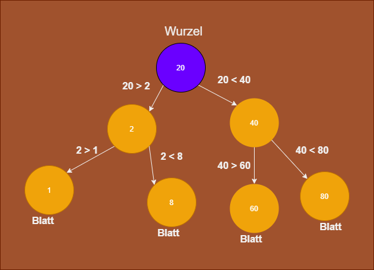

# 6. Übungsblatt Thema: Binärer Baum

**Einführung:**

Um das Thema erweiterbare Datenstrukturen abzuschließen werden hier noch zu Teilen einen Binäre Baum implementieren.
Diese Datenstrukturen erlauben besonderes effiziente Suchen oder Sortierung von Sequenzen.

Was ist ein Binär Baum:



Der oberste Knoten ist die Wurzel. Die Wurzel ist immer das zuerst hinzugefügte Element.
Jeder Knoten kann 0 bis 2 Kinder haben.
Das Kind welches kleiner ist als der Elternknoten kommt nach links.
Das Kind welches größer ist als der Elternknoten kommt nach rechts.

<div class="page-break"></div>

Bei den Testprogrammen werden wir auf eine bereits erstellte Implementierung von GetStringArray aus dem
5\.Aufgabenblatt zugreifen. Der Code ist hier unten beigefügt:

```C#
static string GetStringArray(int[] array)
{
    if (array == null || array.Length == 0)
    {
    return "[]";
    }
    else
    {
    string endText = "[ ";

    foreach (int number in array)
    {
        endText += $"{number} ";
    }

    return endText + "]";
    }
}
```

<div class="page-break"></div>

## 1. Implementierung der Methoden  Insert und ReturnValues in Klasse NumberBinaryTree

**Beschreibung:**

Der Name der Klasse lautet NumberBinaryTree. 

Tipp: Rekursion kann bei einigen Implementierungen in diesem Aufgabenblatt sehr nützlich sein.

Es soll zuerst die Methode Insert implementiert werden. Diese Methode soll einen Integer annehmen und eine Node mit diesen Wert
in einen Binären Baum eingefügen. Dabei wird das 1. eingefügte Element zur Wurzel des Baumes.

Folgende Abbildung verdeutlicht wie sich Insert zu verhalten hat.


<div class="page-break"></div>

Als nächstes soll die Methode ReturnValues implementiert werden. Diese Methode gibt alle Element des Baumes 
als Array zurück. Dieses Array soll genauso groß sein wie Anzahl der Element im Baum.

Dabei soll das Array aufsteigend sortiert sein.

**Deklaration:**

```C#
public class NumberBinaryTree
{
    public void Insert(int number) {}
    public int[] ReturnValues() {}
}

```

---

*Test Program:*

```C#
var numberQueue = new NumberBinaryTree();
Console.WriteLine(GetStringArray(numberQueue.ReturnValues()));
numberQueue.Insert(2);
Console.WriteLine(GetStringArray(numberQueue.ReturnValues()));
numberQueue.Insert(5);
numberQueue.Insert(-8);
Console.WriteLine(GetStringArray(numberQueue.ReturnValues()));
numberQueue.Insert(12);
numberQueue.Insert(222);
numberQueue.Insert(-222);
Console.WriteLine(GetStringArray(numberQueue.ReturnValues()));
```

*Ausgabe sollte sein:*

[] \
[ 2 ] \
[ -8 2 5 ] \
[ -222 -8 2 5 12 222 ]

---

<div class="page-break"></div>


## 2. Implementierung Property Count

**Beschreibung:**

Das Property Count gibt die Anzahl aller Elemente im Baum aus. Dieses Property ist nur eine Getter

**Deklaration:**

```C#
public int Count { get; }
```

---

*Test Program:*

```C#
var numberQueue = new NumberBinaryTree();
Console.WriteLine($"numberQueue.Count = {numberQueue.Count}");
numberQueue.Insert(2);
Console.WriteLine($"numberQueue.Count = {numberQueue.Count}");
numberQueue.Insert(4);
numberQueue.Insert(8);
numberQueue.Insert(-20);
numberQueue.Insert(0);
Console.WriteLine($"numberQueue.Count = {numberQueue.Count}");
```

*Ausgabe sollte sein:*

numberQueue.Count = 0 \
numberQueue.Count = 1 \
numberQueue.Count = 5

---

<div class="page-break"></div>


## 3. Implementierung Property Maximum

**Beschreibung:**

Das Property Maximum gibt den größte Wert im Baum aus. Dieses Property ist nur eine Getter.

**Deklaration:**

```C#
public int Maximum
```

---

*Test Program:*

```C#
var numberQueue = new NumberBinaryTree();
numberQueue.Insert(2);
Console.WriteLine($"numberQueue.Maximum = {numberQueue.Maximum}");
numberQueue.Insert(4);
Console.WriteLine($"numberQueue.Maximum = {numberQueue.Maximum}");
numberQueue.Insert(-4);
numberQueue.Insert(-84);
Console.WriteLine($"numberQueue.Maximum = {numberQueue.Maximum}");     
numberQueue.Insert(200);
Console.WriteLine($"numberQueue.Maximum = {numberQueue.Maximum}");
```

*Ausgabe sollte sein:*

numberQueue.Maximum = 2 \
numberQueue.Maximum = 4 \
numberQueue.Maximum = 4 \
numberQueue.Maximum = 200

---

<div class="page-break"></div>


## 4. Implementierung Property Minimum

**Beschreibung:**

Das Property Minimum gibt den kleinsten Wert im Baum aus. Dieses Property ist nur eine Getter.

**Deklaration:**

```C#
public int Minimum
```

---

*Test Program:*

```C#
var numberQueue = new NumberBinaryTree();
numberQueue.Insert(2);
Console.WriteLine($"numberQueue.Minimum = {numberQueue.Minimum}");
numberQueue.Insert(4);
Console.WriteLine($"numberQueue.Minimum = {numberQueue.Minimum}");
numberQueue.Insert(-4);
numberQueue.Insert(-84);
Console.WriteLine($"numberQueue.Minimum = {numberQueue.Minimum}");
```

*Ausgabe sollte sein:*

numberQueue.Minimum = 2 \
numberQueue.Minimum = 2 \
numberQueue.Minimum = -84 

---

<div class="page-break"></div>

